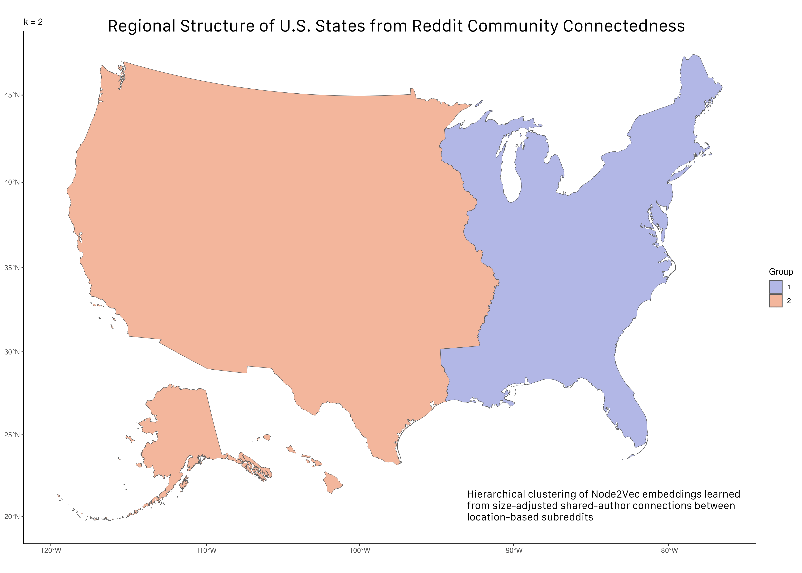

## Research Question & Data

#### Can shared participation in location-based Reddit communities reveal how places in the U.S. are connected?

::: {.columns}

::: {.column width="50%"}

::: {.callout-note appearance="simple" collapse="true" title='Data'}

- **64.7M** Reddit posts & comments
- **4.1M** unique contributors
- **612** U.S. location-based subreddits
- **14 months** of observation:
  - June 2023 ~ July 2024
- Data-intensive analysis with **PySpark + AWS**

:::

:::
::: {.column width="50%"}

<strong>Reddit users</strong>

↓

<strong>Location-based subreddits</strong>

↓

<strong>Shared contributors between subreddit pairs</strong>

↓

<strong>Online connectedness between places</strong>

:::
:::

> **Goal** Use naturally occurring online behavior to measure relationships between places, then test how strongly those relationships correspond to physical geography.
> **Core idea:** Instead of defining regions first, use patterns of shared online participation to ask whether geographic structure emerges from the data.

## From Online Communities to Relationships Between Places

Location-based subreddits are online communities organized around physical places. 
But the same users often participate in multiple local communities, creating connections
between places through shared online activity.

<strong>Reddit Users</strong>
<small>Participate across multiple local communities</small>

→

<strong>Shared Participation</strong>
<small>Connect pairs of location-based subreddits</small>

→

<strong>Place Connectedness</strong>
<small>Measure pairwise relationships</small>

→

<strong>Geographic Structure?</strong>
<small>Distance, borders, and regions</small>

::: {.columns}

::: {.column width="58%"}

### Research Question

**Can shared participation in location-based Reddit communities reveal how places in the U.S. are connected?**

- Does connectedness decline with **geographic distance**?
- Does being in the **same state** matter beyond distance?
- Can connectedness alone recover recognizable **geographic regions**?

:::

::: {.column width="42%"}

### Research Inspiration

Bailey et al. (2018) used Facebook friendship networks to measure **social connectedness between places**, relating it to geographic distance and political boundaries [@baileySocialConnectednessMeasurement2018].

Their connectedness-based clustering further demonstrated how network relationships can reveal geographic regions.

:::

:::

## From Reddit Activity to Place Connectedness

::: {.columns}

::: {.column width="38%"}

### Data

**64.7 million** posts and comments  
**4.1 million** unique contributors  
**619** U.S. location-based subreddits  
**June 2023 – July 2024**

Subreddits represent different geographic scales, including **states, cities, metropolitan areas, and other local communities**.

::: {.small}
Raw Reddit data were processed with **PySpark on AWS** and combined with geographic information for each community.
:::

:::

::: {.column width="62%"}

### Measuring Shared Participation

For each pair of subreddits \(i\) and \(j\):

$$
N_{ij} = |A_i \cap A_j|
$$

where \(A_i\) and \(A_j\) are their sets of contributing authors.

**`n_shared_authors`** therefore measures how many users participated in **both** communities.

Because larger subreddits have more opportunities to share users, I also constructed a size-adjusted measure:

$$
PCI_{ij} =
\frac{N_{ij}}
{\sqrt{|A_i||A_j|}}
$$

**Place Connectedness Index (`pci`)** measures shared participation relative to the sizes of the two communities.

:::

:::

<strong>Reddit Activity</strong>
<small>Posts and comments from location-based communities</small>

→

<strong>Author Sets</strong>
<small>Unique contributors to each subreddit</small>

→

<strong>Subreddit Pairs</strong>
<small>Count shared contributors between communities</small>

→

<strong>Connectedness</strong>
<small>Raw overlap + size-adjusted PCI</small>

::: {.takeaway}
**Unit of analysis:** a pair of location-based subreddits.  
This pairwise representation allows connectedness to be compared with **geographic distance and administrative boundaries**, or treated as a **weighted network** of places.
:::

## Geography Strongly Predicts Online Connectedness

### Pairwise Regression

I modeled the number of shared authors between each pair of location-based
subreddits as a function of their geographic relationship.

$$
\log(N_{ij} + 0.5)
=
\beta_1 \log(D_{ij})
+
\beta_2 \text{SameState}_{ij}
+
\alpha_i + \alpha_j
+
\epsilon_{ij}
$$

::: {.columns}

::: {.column width="55%"}

### Fixed-Effects Results

::: {.small-table}

| Model | Distance | Same State | Adj. $R^2$ |
|---|---:|---:|---:|
| **All pairs** | **−0.458*** | **+1.087*** | 0.791 |
| **≤ 200 miles** | **−0.871*** | **+1.187*** | 0.888 |
| **> 200 miles** | **−0.398*** | **+0.730*** | 0.786 |

:::

::: {.tiny}
*** $p < .001$. Subreddit fixed effects included in all models.
:::

:::

::: {.column width="45%"}

### What Do We Learn?

**Connectedness decreases with distance**

Places farther apart tend to share fewer Reddit contributors.

**The relationship is strongest locally**

The distance coefficient is substantially larger within **200 miles**
than beyond 200 miles.

**State borders also matter**

Communities within the **same state** share more contributors even after
accounting for distance and subreddit fixed effects.

:::

:::

::: {.takeaway}
**Geographic distance and state boundaries are both strongly associated with patterns of shared online participation.**
:::

::: {.small .muted}
Modeling strategy adapted from the geographic connectedness framework of
Bailey et al. (2018) [@baileySocialConnectednessMeasurement2018].
:::

## Can Connectedness Reconstruct Geographic Regions?

Instead of using geography to explain connectedness, I used the **network of shared
Reddit participation itself** to identify groups of places with similar connections.

<strong>PCI Network</strong>
<small>Size-adjusted shared-author connections</small>

→

<strong>Node2Vec</strong>
<small>Learn a network embedding for each state</small>

→

<strong>Hierarchical Clustering</strong>
<small>Complete linkage on state embeddings</small>

→

<strong>Geographic Regions</strong>
<small>Compare clusters with the U.S. map</small>

::: {.columns}

::: {.column width="72%"}

{fig-alt="Hierarchical clustering of U.S. state-level subreddits based on Node2Vec embeddings learned from PCI-weighted Reddit connectedness."}

:::

::: {.column width="28%"}

### What Emerges?

**Broad geographic structure appears without using geographic distance in clustering.**

At lower values of $k$, the network produces broad regional divisions, including a recognizable **East–West structure**.

As the hierarchy is divided further, more localized regional patterns emerge.

::: {.method-note}
**51 communities:** state-level subreddits for the 50 states + Washington, D.C.
:::

:::

:::

::: {.takeaway}
**Online connectedness contains geographic structure:** states with similar patterns of Reddit co-participation tend to form geographically meaningful groups.
:::

## What Does Reddit Connectedness Tell Us?

::: {.columns}

::: {.column width="58%"}

### Main Findings

**1. Online connectedness has a strong geographic structure**

Location-based communities that are geographically closer tend to share more contributors, with a substantially stronger distance relationship within **200 miles**.

**2. State boundaries remain visible online**

Communities within the same state share more contributors even after accounting for geographic distance and subreddit-specific differences.

**3. Geography also emerges from the network itself**

Using only patterns of Reddit connectedness, network embeddings and hierarchical clustering recover recognizable **regional structure** among U.S. states.

:::

::: {.column width="42%"}

### Interpretation & Limitations

- A Reddit contributor is **not necessarily a resident** of the place represented by a subreddit.

- Shared participation measures **co-participation**, not friendship or direct social interaction.

- Location-based subreddits differ substantially in **population, activity, and geographic scale**.

- The regression results describe **associations**, not causal effects.

::: {.method-note}
The state-level clustering uses comparable geographic units (50 states + Washington, D.C.), while the broader pairwise analysis includes location-based communities at multiple geographic scales.
:::

:::

:::

::: {.takeaway}
**Takeaway:** Patterns of shared online participation provide a measurable signal of relationships between places—one that reflects physical distance and administrative boundaries while also revealing broader regional structure.
:::