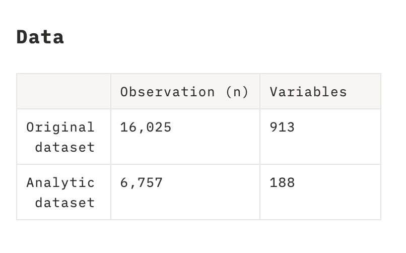
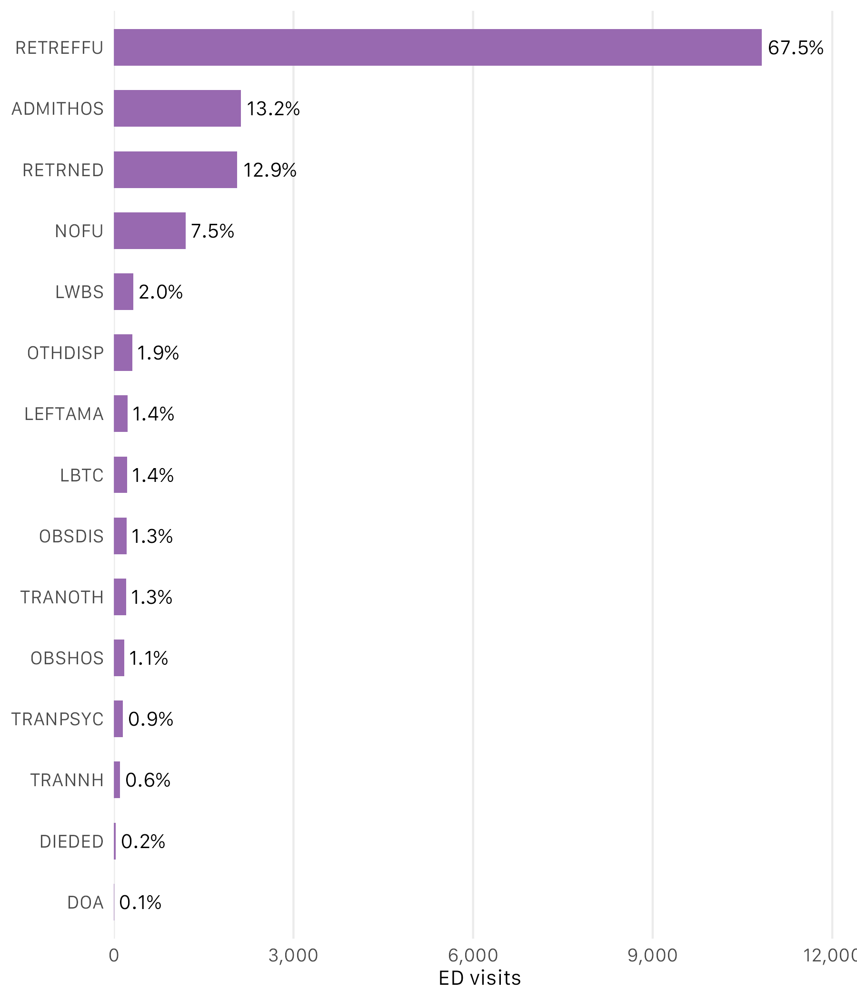
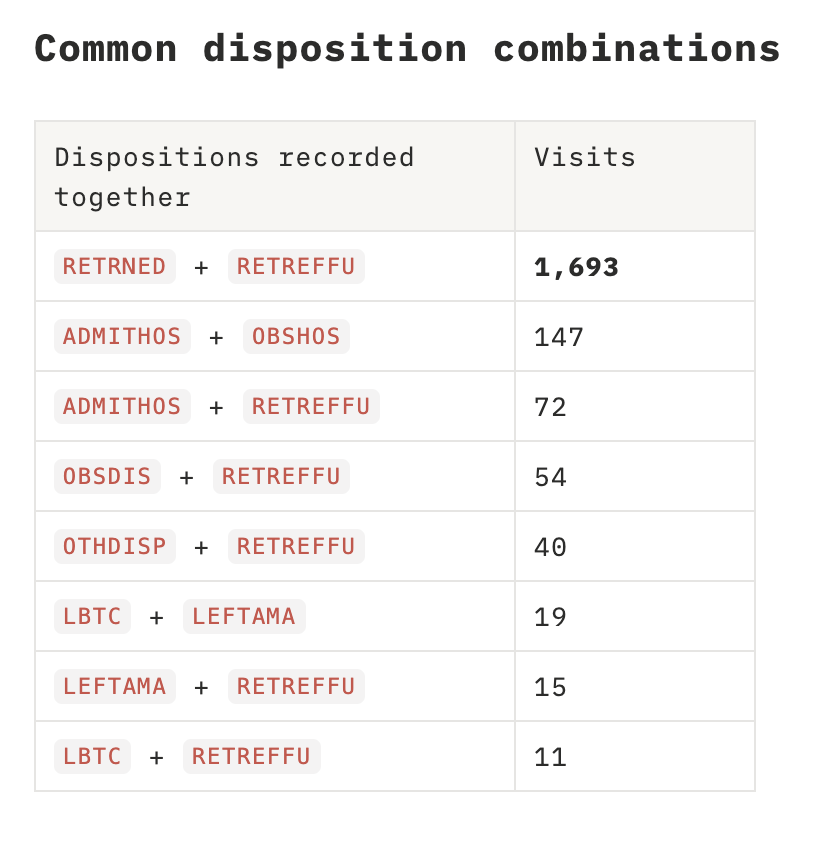
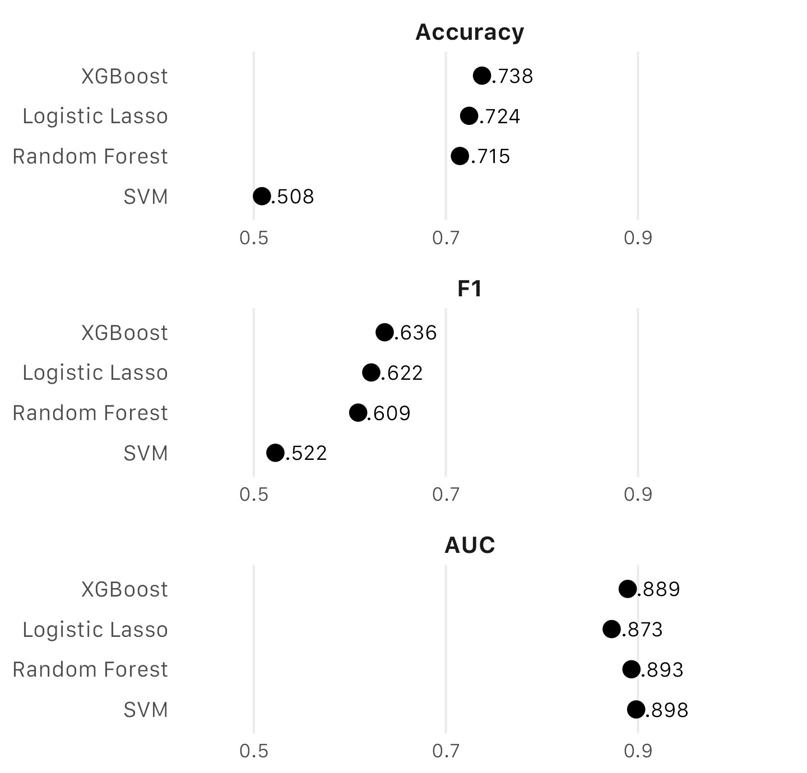
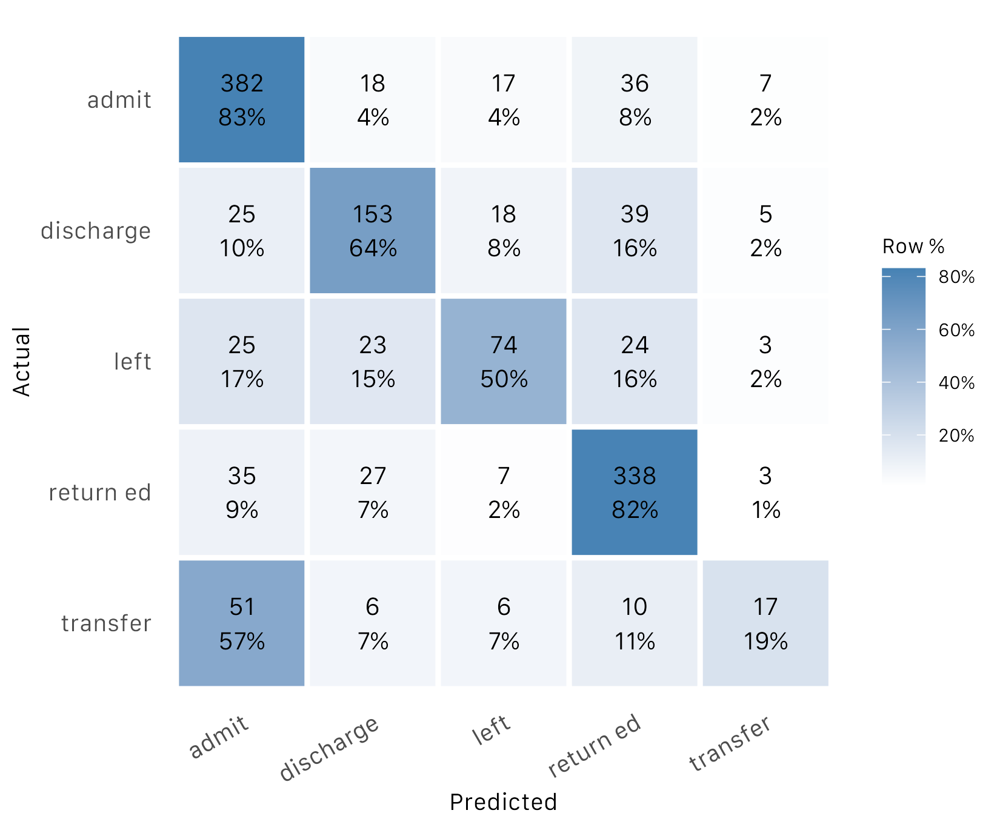
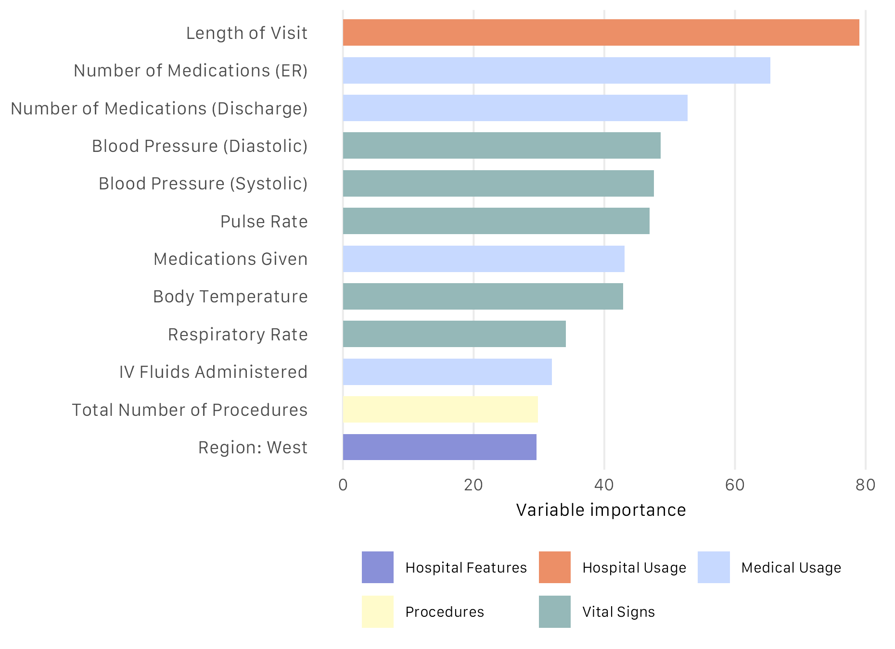
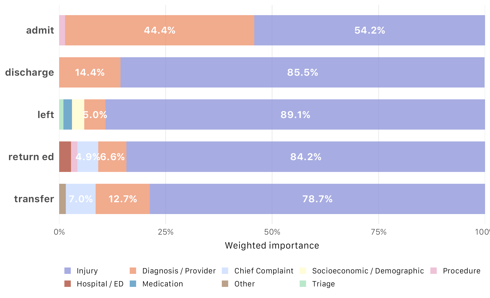

## Data & Analytical Question

::: {.columns}

::: {.column width="58%"}

#### Research question

Can information recorded during an **emergency department visit** help
distinguish different patient disposition outcomes?

```{.r}

        Patient     Triage      Clinical      Care       Hospital
           │           │           │           │            │
      demographics   acuity     vitals      meds /       hospital
                     arrival    diagnosis   procedures    features

```

:::

::: {.column width="42%"}

#### 2022 National Hospital Ambulatory Medical Care Survey (NHAMCS)

From U.S. Centers for Disease Control and Prevention (CDC), a probablity sample representing 155M emergency room visits in the year 2022




:::

:::

<div class="flow">

<div class="flow-step">
<strong>NHAMCS 2022</strong>
<small>ED visit records</small>
</div>

<div class="flow-arrow">→</div>

<div class="flow-step">
<strong>Candidate selection</strong>
<small>188 variables<br>selected from codebook</small>
</div>

<div class="flow-arrow">→</div>

<div class="flow-step">
<strong>Preprocessing</strong>
<small>Missingness · encoding<br>imputation</small>
</div>

<div class="flow-arrow">→</div>

<div class="flow-step accent">
<strong>Statistical learning</strong>
<small>Lasso · SVM · Random Forest· XGBoost</small>
</div>

</div>

<div class="slide-footer-note">

2025 Statistical Learning course project · 5-class multiclass classification

</div>

## Understanding the Outcome

::: {.columns}

::: {.column width="53%"}

#### 16 non-mutually-exclusive variables

{width=100% fig-alt="Prevalence of the original NHAMCS emergency department dispositions"}

:::

::: {.column width="47%"}

#### Overlap was structured

{width=100% fig-alt="Most frequent combinations of NHAMCS emergency department disposition variables"}

:::

:::

<div class="flow">

<div class="flow-step">

<strong>16 binary variables</strong>

<small>Yes / No<br>Non-mutually-exclusive</small>

</div>

<div class="flow-arrow">→</div>

<div class="flow-step">

<strong>Resolve overlaps</strong>

<small>Predefined priority rule<br>select one disposition</small>

</div>

<div class="flow-arrow">→</div>

<div class="flow-step">

<strong>Restrict analytic scope</strong>

<small>Exclude death / DOA, other,<br>no answer, and follow-up</small>

</div>

<div class="flow-arrow">→</div>

<div class="flow-step accent">

<strong>11 labels → 5 classes</strong>

<small>6,757 visits<br>mutually exclusive target</small>

</div>

</div>

<div class="method-note">

<strong>Modeling decision:</strong> This target definition was an analytical simplification for the course project, not a clinically validated disposition hierarchy.

</div>


## Model Performance & Error Analysis

::: {.columns}

::: {.column width="43%"}

### Comparing four model families

{width=100%}

**XGBoost** achieved the highest accuracy and F1, while **SVM** had the highest reported AUC.

:::

::: {.column width="57%"}

### XGBoost test performance: where did errors occur?

{width=100%}

**Transfer** was frequently classified as **admit**; **Left** was also harder to distinguish than admit or returned. A preliminary explanation attributes to **class imbalance** in our training data.


:::

:::

**Takeaway:** The misclassification **Transfer → Admit**, possibly because both groups involve patients requiring continued care. The distinction may depend not only on clinical presentation but also on hospital resource differences.


## **What Did the Model Learn?**

::: {.columns}

::: {.column width="48%"}

### **Overall feature importance**

<div class="figure-model">Random Forest</div>

{width=100%}

<div class="model-summary">

Important predictors spanned multiple aspects of the ED encounter,
including **vital signs, medication use, procedures, and hospital characteristics**.

</div>

:::

::: {.column width="52%"}

### **Feature importance by class: coefficients of Logistic Regression**

<div class="figure-model">Multinomial Regression with Lasso</div>

{width=100%}

<div class="model-summary">

**Injury-related variables dominated most classes**, and are particularly notable for `left` and `return ed` dispositions,  while the remaining
feature mix differed by visit outcome—diagnosis variables for `admission` and `discharge` and chief complaints variables for `transfer` for example

</div>

:::

:::

<div class="takeaway">

**Takeaway:** The models drew on a broad feature space, while
class-specific analysis revealed that **different disposition outcomes
were characterized by different combinations of patient and ED information**.

</div>