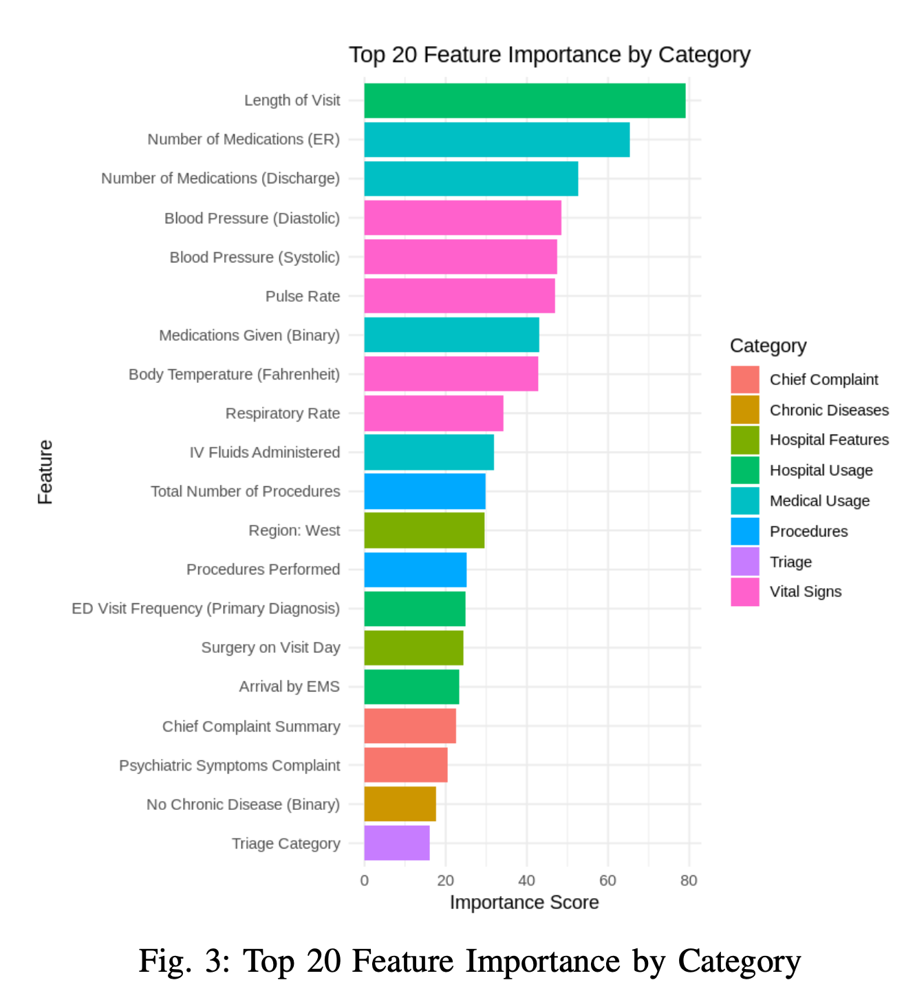

::: {.title-note}
Retrospective, exploratory modeling of public U.S. emergency-department survey data.  
A course project demonstrating a statistical-learning workflow, **not a clinical decision rule**.
:::

## Project question and course scope

:::: {.columns}
::: {.column width="58%"}
### Question

Can structured ED encounter data distinguish several clinically and operationally meaningful **disposition-related outcomes**?

- **2022 NHAMCS Emergency Department public-use data:** 16,025 visits and a high-dimensional feature space.
- Semester-long **Statistical Learning** final project; emphasis was on methods taught in the course rather than deep learning.
- Compared regularized regression, kernel learning, bagging, and boosting while emphasizing cross-validation and interpretation.
- We deliberately simplified a complex set of non-mutually-exclusive disposition indicators into a tractable multiclass learning task.
:::

::: {.column width="38%"}
::: {.callout-note title="Final modeling outcome"}
**Admit** — 2,302  
**Returned** — 2,053  
**Discharge** — 1,202  
**Left early** — 748  
**Transfer** — 452
:::

**6,757 visits** across five mutually exclusive modeled classes.
:::
::::

## Before modeling: understand how the outcome is recorded

:::: {.columns}
::: {.column width="56%"}
### Marginal frequency of raw disposition indicators

RETREFFU<i style="width:100%"></i><b>10,824 · 67.5%</b>

ADMITHOS<i style="width:19.6%"></i><b>2,121 · 13.2%</b>

RETRNED<i style="width:19.1%"></i><b>2,062 · 12.9%</b>

NOFU<i style="width:11.1%"></i><b>1,202 · 7.5%</b>

LWBS<i style="width:3.0%"></i><b>327 · 2.0%</b>

OTHDISP<i style="width:2.9%"></i><b>310 · 1.9%</b>

LEFTAMA<i style="width:2.1%"></i><b>228 · 1.4%</b>

LBTC<i style="width:2.0%"></i><b>221 · 1.4%</b>

:::

::: {.column width="40%"}
### First analytical observation

The 16 Yes/No fields should **not automatically be treated as 16 equivalent competing classes**.

`RETREFFU` alone is marked Yes for **67.5%** of visits, suggesting that follow-up information often coexists with a more specific disposition or care-trajectory indicator.

This motivated examining **within-visit overlap** before defining the modeling target.
:::
::::

## Outcome EDA: overlap is structured, not random

:::: {.columns}
::: {.column width="49%"}
### Most common co-occurrences

| Combination | Visits |
|---|---:|
| RETREFFU + RETRNED | **1,693** |
| ADMITHOS + OBSHOS | **147** |
| ADMITHOS + RETREFFU | **72** |
| OBSDIS + RETREFFU | **54** |
| OTHDISP + RETREFFU | **40** |
| LBTC + LEFTAMA | **19** |

:::

::: {.column width="47%"}
### What this tells us

- **RETRNED + RETREFFU:** a specific return outcome can coexist with follow-up information.
- **ADMITHOS + OBSHOS:** some indicators describe related or sequential stages of care.
- **LBTC + LEFTAMA:** multiple original indicators can ultimately represent the same conceptual outcome group.

::: {.callout-important title="Implication for target design"}
The raw fields mix **destination, care trajectory, and follow-up information**. Defining the response variable was therefore an analytical step, not just a recoding step.
:::
:::
::::

## Outcome operationalization: from 16 indicators to 5 classes

<strong>16 binary indicators</strong>
<small>Yes / No Non-mutually-exclusive</small>

→

<strong>Resolve overlaps</strong>
<small>Apply predefined priority rule to select one disposition</small>

→

<strong>Restrict analytic scope</strong>
<small>Exclude death / DOA, other, no answer, and follow-up</small>

→

<strong>11 labels → 5 classes</strong>
<small>Mutually exclusive modeling target</small>

:::: {.columns}
::: {.column width="58%"}
| Final class | Original labels retained |
|---|---|
| **Transfer** | TRANNH, TRANOTH, TRANPSYC |
| **Admit** | ADMITHOS, OBSHOS, OBSDIS |
| **Returned** | RETRNED |
| **Discharge** | NOFU |
| **Left early** | LBTC, LEFTAMA, LWBS |
:::

::: {.column width="38%"}
::: {.callout-note title="Why simplify?"}
For a semester Statistical Learning project, we operationalized a **single outcome** so that model comparison, cross-validation, and class-specific interpretation remained tractable and clear.
:::

This priority hierarchy was an **analytical choice**, not a clinically validated disposition standard.
:::
::::

## From survey data to a modeling matrix

<strong>NHAMCS 2022</strong>

<small>16,025 ED visits 913 variables</small>

→

<strong>Candidate selection</strong>

<small>188 variables selected from codebook</small>

→

<strong>Preprocessing</strong>

<small>Missingness · encoding imputation</small>

→

<strong>Modeling</strong>

<small>5-class outcome stratified CV</small>

:::: {.columns}
::: {.column width="49%"}
### Feature domains

Demographics, triage, injury, hospital utilization/characteristics, chief complaint, diagnosis, procedures, chronic disease, vital signs, and medications.
:::

::: {.column width="47%"}
### What I would tighten today

Fit imputation, encoding, rare-level handling, and any feature selection **inside training folds**; document the target hierarchy and analytic cohort as part of the reproducible pipeline.
:::
::::

## Model comparison: performance vs. interpretability

| Model | Accuracy | Precision | Recall | F1 | AUC |
|---|---:|---:|---:|---:|---:|
| Lasso multinomial LR | 0.724 | **0.681** | 0.604 | 0.622 | 0.873 |
| RBF SVM | 0.509 | 0.599 | 0.576 | 0.523 | **0.898** |
| Random Forest | 0.715 | 0.652 | 0.596 | 0.609 | 0.893 |
| XGBoost | **0.738** | 0.679 | **0.618** | **0.636** | 0.893 |

<strong>73.8%</strong>best test accuracy XGBoost

<strong>0.636</strong>best reported F1 XGBoost

<strong>0.898</strong>highest reported AUC SVM

::: {.footnote}
Reported values from the 2025 project. The report does not fully specify the multiclass averaging convention for precision/recall/F1/AUC; a revised analysis should define this explicitly and add class-specific metrics.
:::

## Where did the models succeed and struggle?

:::: {.columns}
::: {.column width="48%"}
{fig-alt="Random Forest confusion matrix from the original project" width="95%"}

::: {.footnote}
Random Forest confusion matrix reproduced from the original portfolio deck.
:::
:::

::: {.column width="48%"}
- Admit and Returned, the two largest modeled classes, were comparatively well identified.
- Transfer was often confused with Admit, consistent with both involving continued care while differing in destination and resource context.
- Discharge and Returned were also confused, highlighting the difficulty of distinguishing a later return from a visit ending in discharge using encounter-level features alone.
- The **error structure** is as informative as overall accuracy when thinking about what context may be missing.
:::
::::

## Interpretability: useful patterns, careful language

:::: {.columns}
::: {.column width="46%"}
{fig-alt="Random Forest feature importance from the original project" width="95%"}
:::

::: {.column width="50%"}
- Feature importance highlighted length of visit, medication counts, vital signs, and procedures.
- Partial dependence plots were used to inspect nonlinear model associations for length of visit and pulse across classes.
- Lasso multinomial regression supplied class-specific sparse coefficients as a complementary, more transparent view.
- These are **predictive associations**, not causal effects or clinical thresholds.
- Some high-importance variables occur after substantial care has happened, so usefulness depends on the intended **prediction time**.
:::
::::

## What I would improve for a clinical research setting

:::: {.columns}
::: {.column width="49%"}
::: {.callout-note title="Question / outcome design"}
- Define the intended prediction time and clinical/operational use case first.
- Revisit the five-class outcome and priority hierarchy with ED clinicians.
- Consider whether some original indicators should be separate endpoints or sequential outcomes instead of forcing one label.
- Respect NHAMCS survey design for population-level inference.
:::
:::

::: {.column width="49%"}
::: {.callout-note title="Modeling / evaluation"}
- Use fold-contained preprocessing and nested tuning.
- Remove downstream variables unavailable at the chosen prediction time.
- Report per-class sensitivity/PPV, macro-F1, calibration, and uncertainty intervals.
- Compare with simple baselines and validate externally before deployment claims.
:::
:::
::::

## Takeaway

::: {.takeaway}
A course project that taught me both **how to build models** and **how much the definition of the clinical question matters**.

:::

:::: {.columns}
::: {.column width="31%"}
### Statistical learning
Regularization, SVM, Random Forest, XGBoost, cross-validation, and tuning.
:::
::: {.column width="31%"}
### Data reasoning
Interrogate a messy outcome, operationalize the target, inspect errors, and interpret predictor patterns.
:::
::: {.column width="31%"}
### Next step
Refine outcome and prediction timing with practitioners, then redesign validation around the clinical workflow.
:::
::::

::: {.footnote}
Source: 2022 National Hospital Ambulatory Medical Care Survey (NHAMCS) ED public-use data. Original work: 2025 Statistical Learning final project.
:::
